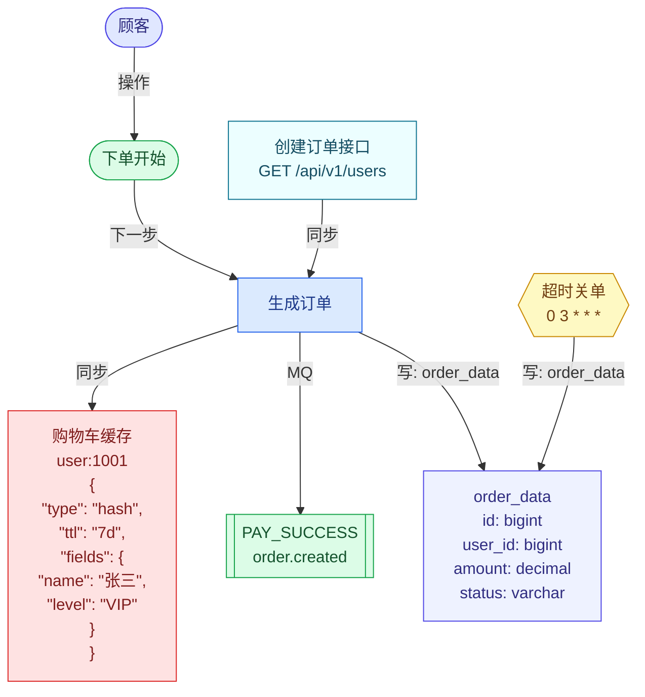

# 订单链路示例

## 流程图

```mermaid
flowchart TB
  r_customer_euw4s(["顾客"]):::role
  s_order_start_gw1nv(["下单开始"]):::mq
  api_create_order_api_utuqf["创建订单接口<br/>GET /api/v1/users"]:::blk_builtin_api
  p_create_order_gt389["生成订单"]:::process
  rd_cart_cache_o76m3["购物车缓存<br/>user:1001<br/>{<br/>  &quot;type&quot;: &quot;hash&quot;,<br/>  &quot;ttl&quot;: &quot;7d&quot;,<br/>  &quot;fields&quot;: {<br/>    &quot;name&quot;: &quot;张三&quot;,<br/>    &quot;level&quot;: &quot;VIP&quot;<br/>  }<br/>}"]:::blk_builtin_redis
  m_pay_success_3zh4f[["PAY_SUCCESS<br/>order.created"]]:::mq
  j_close_timeout_8xu94{{"超时关单<br/>0 3 * * *"}}:::job
  t_order_data_kht6t["order_data<br/>id: bigint<br/>user_id: bigint<br/>amount: decimal<br/>status: varchar"]:::table
  r_customer_euw4s -->|操作| s_order_start_gw1nv
  s_order_start_gw1nv -->|下一步| p_create_order_gt389
  api_create_order_api_utuqf -->|同步| p_create_order_gt389
  p_create_order_gt389 -->|同步| rd_cart_cache_o76m3
  p_create_order_gt389 -->|MQ| m_pay_success_3zh4f
  j_close_timeout_8xu94 -->|写: order_data| t_order_data_kht6t
  p_create_order_gt389 -->|写: order_data| t_order_data_kht6t
classDef role fill:#e0e7ff,stroke:#4f46e5,color:#312e81
classDef process fill:#dbeafe,stroke:#2563eb,color:#1e3a8a
classDef table fill:#eef2ff,stroke:#4f46e5,color:#312e81
classDef job fill:#fef9c3,stroke:#ca8a04,color:#713f12
classDef mq fill:#dcfce7,stroke:#16a34a,color:#14532d
classDef blk_builtin_api fill:#ecfeff,stroke:#0e7490,color:#164e63
classDef blk_builtin_redis fill:#fee2e2,stroke:#dc2626,color:#7f1d1d
```

## 存疑清单

<!-- 虚线代表待确认；每条虚线对应下面一条，确认后把 [ ] 改成 [x] -->

<!-- 本图没有虚线（待确认项） -->

## 变更记录

- 2026-10-15 11:10 v1 导出（8 节点 / 0 分组 / 7 连线）
